# Curso de CSS básico

## 📚 Curso

📌 **HTML** - [Acceder al curso](https://github.com/alejanCodeGF/Curso-Desarrollo-Web/tree/main/Curso-HTML)\
🎨 **CSS** - [Acceder al curso](https://github.com/alejanCodeGF/Curso-Desarrollo-Web/tree/main/Curso-CSS)\
💻 **JavaScript** - [Acceder al curso](https://github.com/alejanCodeGF/Curso-Desarrollo-Web/tree/main/Curso-JS)

---

## 👤 Sobre el Autor

**AlejanCodeGF**

📎 [LinkedIn](https://www.linkedin.com/in/alejan-gomez-fernandez/)\
🌐 [Portfolio Web](https://alejancodegf.github.io/Portfolio)

✉️ **Contacto**: [alejan.gomez.fernandez@gmail.com](mailto\:alejan.gomez.fernandez@gmail.com)

---

## Poner un comentario

```
[/*COMENTARIO*/]
```

## Estructura

```
[Selector {propiedad: valor;}]
```

## Selectores

```
Forma de hacer "grupos" de elementos para cambiar su estilo

1. Universal '*': Selecciona todos los elementos
    > Si lo pones al final del fichero, solo editará los que no han sido ya definidos
2. De tipo: Seleccionar por elemento
    > (P.e: button, input, h1, etc.)
3. Por clases: Agregar atributo class="nombre_clase" al elemento y luego llamarlo con ".nombre_clase"
    > Podemos poner varias clases si separamos por un espacio cada nombre
        > (P.e: "vertical no_style ...")
4. Por ID: Agregar id="elemento_id" y luego llamarlo con "#elemento_id"
    > El id debe ser unico
5. Por atributo: Seleccionamos un atributo-valor
    > Nos podemos inventar el atributo
        > (P.e:  css -> [Comida="postre"]{...})
    > Incluso le podemos especificar a que tipo (li[...], se lo estamos aplicando a los li con ese atributo)
- 5.1. "[atributo="valor"]": Selecciona elementos cuyo atributo es exactamente igual al valor
- 5.2. "[atributo^=valor]": Cuyo atributo comienza con el valor especificado
- 5.3. "[atributo$=valor]": Cuyo atributo termina con el valor especificado
- 5.4. "[atributo*=valor]": Cuyo atributo contiene el valor especificado en cualquier posición
- 5.5. "[atributo~=valor]": Cuyo atributo contiene el valor entremedias, solo si está separado por espacios
    > (P.e: Si valor = "Hola", si atributo="Ey ComoEstas Hola QueTal", lo seleccionará, porque está separado por espacios)
6. Descendiente ("espacio") ("selector-padre selector-hijo{...}"): Seleccionar etiquetas dentro de otras (todas)
    > Los llamamos de izquierda a derecha, de mas contenedor a menos
        > (P.e: <p><a>asdasd</a></p>, el p contiene al a, entonces p a {...})
    > Podemos poner mas de 2 selectores, si tiene varios hijos (nietos nose como decirlo xd)
7. Descendiente directo (">") ("selector-padre > selector-hijo"): Muy parecido, pero SOLO lo selecciona si es hijo directo
    > Es decir, si hay otro selector entre ambos, no lo selecciona, a diferencia del otro que selecciona todos
        > (P.e: <p><a>asd<span>asd</span></a></p>, si hago p > span no lo detecta, porque hay un <a> entre medias, pero p span sí)
8. Hermano siguiente ("+") ("elemento1 + elemento2"): selecciona el elemento 2 que va justo despues del elemento 1
    > (P.e: "h1 + h2{...}" selecciona al h2 solo si está a continuación de un elemento h1)
        > <h1>Titulo1</h1>  <h2>Elemento que selecciona</h2> <p>asdasd</p> <h2>Elemento que no selecciona</h2>
9. Todos los hermanos ("~") ("elemento1 ~ elementos"): Selecciona todos los hermanos, y no solo el primero
10. Seleccionar mas de un selector (","): Puedes aplicar el mismo estilo a varios selectores
    > (P.e: selector1, selector2 {...} le estamos aplicando a los 2 selectores)
11. Pseudo-clases: Palabras clave que añades a un selector para aplicar estilos a un elemento según su estado
    > (P.e: Pasar el raton por encima hace algo -> p:hover)
    > (P.e 2: Seleccionar el primer hijo de la lista -> div:first-child)
12. Pseudo-elementos: Palabras clave que añades a un selector para aplicar estilos a partes específicas de un elemento
    > (P.e: Añadir texto antes y después de un paragrafo -> p::before, p::after)
```

[**{Pseudo-elementos mas importantes}**](#pseudo-elemento)
[**{Pseudo-clases mas importantes}**](#pseudo-clases)
[**{TODOS los selectores (mas completo)}**](https://www.w3schools.com/cssref/css_selectors.php)

```
- Se pueden mezclar cosas
    > (P.e: "a p:hover", y hay descendiente + pseudo-clase)
    > (P.e 2: "p a > span", seleciona hijos directos de <a> dentro de <p>)
    > etc.
```

## Especifidad

|AQUI|
No está del todo bien explicado, lo editaré en el futuro (Por ahora busca en google especifidad 1,0,0,0)

```
Cuando un selector recibe varios estilos a la vez, ¿cual tiene en cuenta?
CSS va por cascada (ultimo mas importante), pero hay una jerarquia de importancia dependiendo del tipo

Orden de jerarquia:
[!important] -> [estilos de línea] -> [identificadores] -> [clases, pseudo-clases, atributos] -> [elementos, pseudo-elementos]

> Estilo de línea es [style="...:..."] en el codigo HTML
> Para poner la prioridad, poner "!important" justo antes del ";" de la propiedad
```

```
Ejemplos:
h1{...} h1{...} h1{...} será cascada, osea el que importa es el ultimo
selector {...} h1{...} será especifidad, el que importa es el selector, aunque h1 esté al final
selector {...} selector{...} será otra vez cascada, seleccionará el ultimo
```

## Heredar

```
P.e: Atributo de un elemento dentro de una lista, el elemento mirará si tiene un estilo, si no lo tiene, mirará si la lista tiene, y asi hasta llegar al final
    > Si no hay ningun estilo, pone el default (obvio)

Pero hay algunos que no heredan
    > (P.e: el <a> con el color)
    > Lo que hay que hacer en ese caso es poner [a{color: inherit;}], y le pondrá el atributo heredado
        > Pasa porque tienen definido un color en la hoja de estilo de agente de usuario

Y si no queremos que herede?
    > En vez de "inherit" poner "initial", y no le afecta al elemento aunque herede
```

## Unidades de medida

```
Fijas: No varian
px -> Pixeles
cm -> Centímetros
mm -> Milímetros
...

Relativas: Se adaptan al contexto
em -> 1em será igual al font-size de la caja contenedora (o al elemento padre)
    > (P.e: si font-size = 16px, 4em = (16*4 == 64)px)
rem -> 1rem será igual al font-size de la caja raiz (:root / html),
    > Parecido al em, pero no varia tanto y es mas estable
    > Es el que se suele usar para poner el tamaño de letra
ch -> Basicamente el width del caracter
    > Normalmente se usa para el width los paragrafos de texto, y saber cuantos ch hay por linea
        > No superar los 75ch, queda peor y es menos legible
vw -> Porcentaje de la pantalla horizontal (width)
    > 100vw = toda la pantalla, 50vw = la mitad de la pantalla...
vh -> Porcentaje de la pantalla vertical (height) (lo mismo de arriba)
% -> Porcentaje (pero va ligado a la caja contenedora)
...
```

## Propiedades del texto

```
font-size -> Tamaño de la letra
font-family -> Fuente de la letra
line-height -> Cantidad de espacio vertical que se reserva entre las líneas de texto dentro de un elemento
    > Si la fontsize es muy pequeña, dejaría espacio en blanco arriba y abajo (el texto se queda centrado)
        > (Imagen abajo explicado)
font-weight -> Grosor de la letra
    > normal | bold | px, cm, etc.
font-style -> Estilo como cursiva raro
    > normal | italic | oblique
text-align -> Alineación del texto
    > left | right | center
text-indent -> Sangría de la primera linea
text-decoration -> Adornos para el texto
    > none | underline(___) | overline (___ pero arriba) | line-through(tachado) | blink (parpadea)
text-transform -> Convertir en mayusculas o minusculas un texto
    > none | uppercase | lowercase | capitalize (1a letra palabra mayuscula)
letter-spacing -> Distancia de separación de las letras (Chusta)
    > Unidades normales, se puede poner en negativo
word-spacing -> Distancia de separación (espacios) de las palabras (Parecido al de arriba)
white-space -> Comportamiento de los espacios DENTRO de un elemento HTML
    > En default es "normal", si pones varios espacios pone solo 1, y si pones en varias líneas tampoco lo respeta
    > normal | pre (espacios + \n) | nowrap (si no cabe en la pantalla, te la continua (scroll-y)) | pre-wrap (espacios) | pre-line (\n)
text-shadow -> Sombra del texto, propiedad acortada (shorthand)
    > eje x, eje y, desenfoque, color
        > (P.e: 1px 1px 2px red;)
font-variant -> Poner diferentes variables para una fuente
    small-caps -> Escribir un texto en versalitas (mayusculas pequeñas)
    ...
```

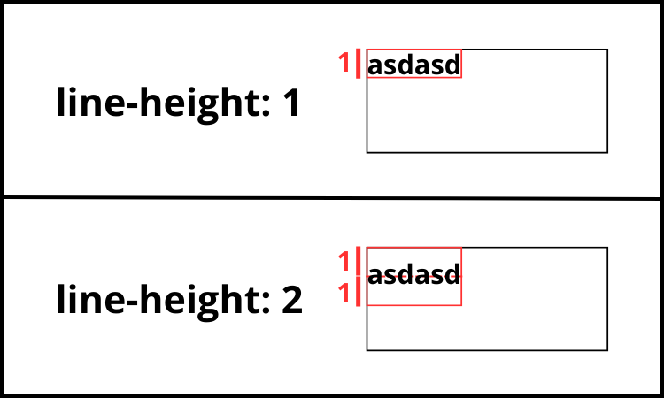

## Importar tipografias

```
@import url("URLtipografia") -> Para importar una tipografia con url (Ponerlo arriba del css)
    > Tener en cuenta que la URL puede fallar en el futuro, no tienes control

Importar una tipografia desde "local" (ya descargadas)
@font-face {
  font-family: my-cool-font;
  src: url(../fonts/the-font-file.woff);
}
    > Extensiones mas comunes: .TTF, .OTF, .FNT, .WOFF, .WOFF2
        > Tenerlo en cuenta, porque igual no lo acepta el navegador
    > Obviamente es algo más para descargar, por lo que puede tardar más en cargar
```

[**{Link para exportar nuevas tipografias}**](https://fonts.google.com/)

## Resetear estilos del navegador

```
Esto se hace para poner los estilos por defecto que nosotros queramos y no los de los distintos buscadores

Hay varios ficheros css creados por la comunidad, uno de los mas comunes es el "normalize"

Lo importante es entender que hace cada reset, y crear uno a tu medida, o como lo necesites
```

[**{Link al fichero de css "normalize"}**](https://github.com/necolas/normalize.css)
[**{"Reset CSS", más sencillo pero más impreciso}**](https://meyerweb.com/eric/tools/css/reset/)

## Cajas

```
Todos los elementos estan formado de cajas
Depende del display de las cajas, tendrán un comportamiento o otro entre ellas
```

[**{Apartado "display"}**](#display)

### Box-sizing

```
Propiedad CSS que determina cómo se calcula el tamaño total de una caja
Controla si el tamaño especificado de la caja incluye o no el relleno y el borde

Box-sizing:
    content-box -> Si definimos un height y un width, le suma el padding de la caja
        > (P.e: si padding es de 50 a los lados, caja será de 50*2 + width)
        > Si ponemos borde, a la caja normal le suma alrededor, y no le resta (como al border-box)
    border-box -> Si definimos un height y un width, será la caja
        > Respeta mas los numeros que pides
        > Si pones un borde, lo pone subtituyendo parte de dentro, en vez de añadirlo fuera
```

### Box model

```
Jerarquia de lo que hay al rededor de la caja y como esta ordenado
```

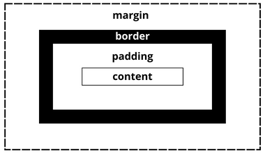

### Padding

```
Distancia entre el texto y los bordes de la caja

Hay 4 paddings, para cada lado de la caja:
padding-top | padding-right | padding-bottom | padding-left

Lo podemos acortar usando padding (shorthand property):
padding: x; -> Todos los bordes tienen x pixeles
padding: x y; -> x = arriba y abajo, y = izquierda y derecha
padding: x y z w; -> x=top, y=right, z=bottom, w=left
padding: x y z; -> Aqui entonces left será el mismo que right (x y z y)
```

### Margin

```
Distancia de separación entre cajas
Lo mismo que padding, pero con margin
    > margin-top, margin-right..., y lo mismo el shorthand

> margin: auto -> Centra la caja en medio (pone espacio a los lados)
> Si hay un pequeño espacio, puede ser que en el HTML está en una nueva línea
```

### Border

```
Borde de la caja

border-radius -> Redondear los bordes
border-width -> Grosor del borde
border-style -> Estilo del borde
    > solid | dashed | double | groove | inset(3d) | outset(3d) | etc.
border-color -> Color del borde

border: border-width border-style border-color, etc (shorthand)
```

### Propiedades de las cajas

```
background-color -> Color de fondo de la caja
padding -> [Arriba explicado]
height -> Alto de la caja
width -> Ancho de la caja
box-sizing -> [Arriba explicado]
text-align -> Posición del texto
    > center | left | right...
margin -> [Arriba explicado]
border -> [Arriba explicado]
box-shadow -> Sombra de caja, propiedad acortada
    > eje x, eje y, cantidad de desenfoque, borde (0 normalmente), color
transform: -> Transformar la caja (más adelante mejor explicado)
    rotate(deg) -> Rotar la caja (deg == grados)
    translate(ejex, ejey)
    ...
opacity -> Opacidad. De 0 (transparente) a 1 (opaco) (0-100%)
```

[**{Apartado "transform"}**](#transform)

### Outline

```
Muy parecido a border pero sin afectar a las demas cajas
    > No ocupa espacio en el DOM, simplemente "resalta" como un marcador

Outline: outline-width outline-color, etc. (shorthand)

- Cuando lo ponemos si hay una caja pegada, el borde de outline lo pondrá por encima, sin moverla
- Ademas, al usar el "border-box", al hacer outline no reduce el tamaño de la caja (como en border), lo pone por fuera
```

### Position

```
Diferentes formas de posicionar las cajas, para diferentes comportamientos

position:
    static (Por defecto)
        > No le afectan las propiedades top, right, left o bottom (NO ESTÁ POSICIONADO)
        > Deberia seguir el "document flow" (Cada elemento tiene su espacio, como siempre)
    relative
        > Actua como el static (document flow), pero ahora se puede mover ('#Punto de referencia')
        > Ahora si está posicionado
            > Se suele usar para cuando tiene un elemento hijo con "absolut", para que se adapte al contenedor
        > Si se mueve deja el espacio que ocupaba igualmente, un vacio con el background de la web
    absolut
        > Posicionamos la caja, y le quitamos el espacio que tenia reservado
            > Todo lo de alrededor se reposiciona ocupando el espacio que deja, como si no existiera
        > El ancho se ajusta al contenido (inline)
        > Si no defines punto de referencia, se queda donde estaba definido al principio (document flow)
        > Si lo defines, el punto de referecia será el contenedor, solo si este está posicionado
            > Y si no lo está, el contenedor será la propia web (top: 0 lo pondrá arriba del todo de la web) 
    fixed
        > Se "pega" a la pantalla, bajando contigo mientras haces scroll
        > NO reserva espacio (como el absolut)
        > (P.e: Para publicidad, que se queda fijo en la pantalla mientras bajas por la web)
    sticky
        > Mezcla entre relative y fixed
            > Reserva el espacio, y se pega
        > Cuando bajas cierto punto, un texto que estaba en medio de la web se queda "fixed", y baja contigo
            > (P.e: Un aviso importante despues de un apartado, que quieres que se siga mostrando, y lo pegas en la parte de arriba de la web)
        > Baja hasta el final del contenedor
```

### Punto de referencia

```
Posicionar una caja con position

top -> Deja n pixeles de espacio entre arriba y el elemento
left -> Deja n pixeles de espacio entre izquierda y el elemento
bottom -> Deja n pixeles de espacio entre abajo y el elemento
right -> Deja n pixeles de espacio entre derecha y el elemento

Para centrar el elemento justo en medio podemos hacer:
top:0; left:0; right:0; bottom:0; margin:auto;

> En caso de haber 2 que se superponen, solo tiene en cuenta top y left
    > (P.e: Pones un top, y un bottom a la vez, solo importa el top)
> Es posible poner numeros negativos (hará lo contrario vaya)
```

### Z-index

```
Donde se posicionan los elementos en el eje z
    > Es decir, cuando se superponen, cual muestra por encima de las otras
    > Va como por "capas"

Reglas:
A mayor numero z-index, mas por encima de las demás está
Por defecto z-index será 0, y el orden será el del codigo
    > (P.e: Si primero pongo h1, y luego h2, h2 estará por encima)

> Si queremos poner a un elemento hijo por debajo de un padre
    > Poner un z-index de -1 al hijo y al padre no ponerle z-index
        > (P.e: (div -> h1), h1 será el hijo y div será el padre
    > Pero no es correcto, es un problema
```

```
|LO MEJOR ES PONER Z-INDEX SUPER DIFERENCIADOS ENTRE ELLOS|
    > Dejar 40-50 espacios z-index entre elementos
    > Por si queremos añadir una caja entremedias
```

### Display

```
Modificar el comportamiento de las cajas (relaciones)

display:
    inline (en linea)
        > Ocupan lo que ocupe el contenido
            > Si hay varios elementos en linea, se pone uno al lado del otro
        > NO se les puede poner cualidad de height y width
    block (en bloque)
        > Siempre se van a ajustar al ancho de la pantalla o recipiente
        > SI se les puede poner cualidad de height y width
    inline-block -> Es un inline que podemos modificar el ancho y el alto
    table -> [Desfasao, ni se usan]
    flex -> [Maquetación de la web]
    grid -> [Maquetación de la web]
    inline-flex -> flex se comporta como block, si usas este será inline
    inline-flex -> grid se comporta como block, si usas este será inline
```

[**{Apartado "flex" y "grid"}**](#maquetar-la-web-i-flexbox)

## Background

```
Todas las funciones de background

background-color: color
background-image: link de la foto
background-size:
    x, y -> Ponemos el tamaño de la imagen que queremos
    auto (Por defecto) -> Se muesta con los tamaños de la imagen real
    cover -> Si ponemos esto, la imagen se reescala lo mejor que se puede
    contain -> Se ajusta a las resoluciones reales de la imagen para que quepa
        > Si hay espacio sobrante, hace lo de -repeat abajo, lo que le indiques
background-repeat:
    repeat (Por defecto) -> Se repite la imagen si no cabe
    no-repeat -> No se repite la imagen, mostrando el fondo del elemento
background-clip -> [Mirar el link]
background-origin -> [Mirar el link]
background-position -> Posicionar el elemento
    > ejeX (left, center, right) ejeY (top, center, bottom)
        > (P.e: left top, bottom center, center center, etc.)
            > No poner left left, o right right, no tiene sentido
background-attachment -> Como se visualiza la imagen
    scroll -> Imagen normal, si bajas es fija al contenedor y no se mueve
        > Imagen de toda la vida, como en el word o el pdf
    fixed -> Si bajas, la imagen está como por detrás de la pantalla fijo a esta
        > Si la imagen está en un recuadro, cuando bajes se verá como la vas "recortando" mientras bajas
```

[**{background-clip}**](https://developer.mozilla.org/en-US/docs/Web/CSS/background-clip)
[**{background-origin}**](https://developer.mozilla.org/en-US/docs/Web/CSS/background-origin)

## Overflow

```
Es cuando un texto (o imagen) sobresale y hay que hacer scroll
Hay varias formas de editarlo

Overflow:
    inherit -> Dejar que se sobresalga y no hacer nada
    auto -> Si el contenido sobresale, nos deja scrollear dentro de la propia caja
        Y ademas no sobresale el contenido, se queda dentro de la caja
    scroll -> Pone una barra de scroll igualmente, aunque quepa el contenido
    hidden -> No sobresale y no deja hacer scroll

> Puedes indicar si quieres hacer un eje o el otro individualmente:
overflow-x -> En el eje x
overflow-y -> En el eje y
```

```
Truquito truquete:
> Si ponemos una imagen dentro de un cuadrado pequeño, la imagen se ajusta siempre aunque sea muy grande
> Lo que hace que no se ajuste es cuando le hacemos position relative y lo movemos de sitio
> Si a su vez hacemos hidden, la parte de la imagen que sale del cuadrado la pone invisible (no sobresale)
> Queda como la imagen recortada, por la caja que lo rodea (Como que esta escondida detras de una pared)
```

## Float

```
Para recolocar la web ya no se usa, ahora se usa flex y grid
Para lo que es util es para colocar una imagen y que el texto se ajuste a la imagen
    > Rollo en un word cuando se ajusta el texto a una imagen

Reglas:
Texto no debe de estar dentro de un paragrafo (ningun contenedor)
Imagen tiene que estar arriba del texto
Pondremos la imagen de tipo float: right, left o donde queramos colocarlo
```

## Pseudo-elemento

```
Podemos seleccionar de un selector una parte y editarla

SOLO APLICABLES A LOS QUE NO SON INLINE:
"Selector::first-letter {...}" -> Selecciona la primera letra
"Selector::first-line {...}" -> Selecciona la primera línea (y se adapta al contorno)

PARA CUALQUIERA:
"Selector::placeholder {...}" -> Seleccionar el texto del placeholder
    > Cuando vas a escribir, el placeholder se va y se pone el estilo que tenias en el imput o lo que sea
    > Solo se puede utilizar en elementos que tengan placeholder
"Selector::selection {...}" -> Para seleccionar lo que el usuario selecciona
    > Basicamente el de base es el azul y las letras blancas, pues editar eso

En estos podemos ver cambios visuales sin afectar al DOM (Tanto inline como block):
    > Para añadir el contenido, poner "content: "el texto que quieras poner";" dentro de {...}
"Selector::before {...}" -> Dado un elemento en el selector, puedes añadir un texto ANTES y ponerlo como quieras
    > No se podrá seleccionar el texto, será como un fantasma (pero si que mueve el contenido, tiene espacio reservado)
"Selector::after {...}" -> Dado un elemento en el selector, puedes añadir un texto DESPUES y ponerlo como quieras
    > Tampoco se podrá seleccionar
```

## Pseudo-clases

```
Principalmente, los eventos de una selección
[elemento:acción]

:hover -> Cuando pase el ratón por encima
    > En todos los elementos menos los pseudo-elementos
:active -> Cuando mantienes apretado el elemento
:link -> Links que NO has visitado
    > Si no existen tampoco lo marcará
    > Solo si devuelve un 200 de respuesta (codigo web)
:visited -> Links ya visitados
:focus -> Inputs siendo utilizados
    > (P.e: Escribir, o lo que sea)
:checked -> Inputs de radio/checkbox cuando están marcados
:lang(lenguaje) -> Para seleccionar si algo esta en "en", "es", o el idioma que sea
    > Atributo lang="..." en el elemento html

transition: elemento_a_cambiar segundos (s)
    > Para que algo no cambie automaticamente, sino que haga una transición
    > (P.e: transition: height 1s, background: 2s;)
        > En vez de hacerlo instantaneo, tardará 1 en la altura y 2 en el background

Peeero se pueden usar también de selectores:
- 1. "Selector:first-child": Para de ese grupo (div, lista, etc.), selecciona el primer elemento
- 2. "Selector:last-child": Lo mismo que el first-child, pero al revés, selecciona el ultimo
- 3. "Selector:only-child": Lo selecciona unicamente si es el unico hijo
- 4. "Selector:nth-child(i)": Parecido al first-child, pero selecciona el elemento "i" de la lista de elementos.
    > Varias formas interesantes de usarlo:
        > .elementos:nth-child(5) - Selecciona el 5o elemento
        > .elementos:nth-child(3n) - Selecciona cada 3er elemento (3, 6, 9...)
        > .elementos:nth-child(3n + 2) - Selecciona cada 3er elemento, empezando por el 2o (2, 5, 8...)
        > .elementos:nth-child(-n + 4) - Selecciona desde el 4o elemento hasta el 1o, en ese orden
        > .elementos:nth-child(even) - Selecciona los elementos pares (even / odd)
- 5. "Selector:first-of-type": Selecciona el primero de ese tipo de selector
- 6. "Selector:last-of-type": Lo mismo que el first-of-type, pero al revés, selecciona el ultimo
- 7. "Selector:only-of-type": Lo seleciona unicamente si es el unico de su tipo (parecido al only-child)
- 8. "Selector:nth-of-type(i)": muy parecido al nth-child(i), pero busca del mismo tipo
- 9. "Selector1:not(selector2)": Selecciona a los selectores1 que no cumplan el selector2 del "not"
    > (P.e: div:not(.error) -> Seleccionará todos los divs, menos a los que tengan clase = "error")
```

## Object-fit

```
Para cambiar las resoluciones de las imagenes
    > (P.e: Ajustar una imagen a un contenedor sin que se deforme tanto)

object-fit:
    fill -> La de base, se adapta al contenedor deformandolo
    contain -> Resoluciones de la imagen se ajusten al contenido
        > Bandas negras vaya
    cover -> La imagen se recorta para ajustarse al contenedor
    none -> Pone las resoluciones originales, da igual que entren o que no entren
    scale-down -> Cual tiene menor resolución, none o contain? Pues pongo esa
```

## Object-position

```
Para cuando hacemos object-fit, colocar la imagen
    > En vez de estar centrado, podemos poner desde la izquierda, desde la derecha...

object-position:
    > left | right | top | bottom | tamaño que se desplaza (px, etc.)
```

## Cursor

```
Cambiar el cursor
    > (P.e: Cuando pasas por encima de algo y se cambia la imagen del cursor)

Los más importantes
cursor:
    default -> El de siempre
    none -> Te borra el cursor
    pointer -> La mano con el dedo indice
    wait -> Circulo que indica que se esta cargando
    text -> El "I" cuando estas encima de un texto
    crosshair -> Como una mirilla (un "+")
    grab -> Manito para agarrar
    grabbing -> Manito cuando agarras
```

[**{Todos los tipos de cursores}**](https://www.w3schools.com/cssref/tryit.php?filename=trycss_cursor)

## Colores

```
En informática los colores se forman en rojo, verde y azul (rgb)
Hay varias formas de aplicar colores, son los siguientes:
```

### Color name

```
Nombres de los colores, en vez de hacer rgb o hexadecimal
    > (P.e: black, white, red...)
Aqui los colores los elige el navegador
    > No es tan especifico si es que queremos un tipo de color exacto
```

[**{Todos los nombres de los colores}**](https://www.mclibre.org/consultar/htmlcss/css/css-color.html)

### rgb (/a)

```
rgb(cantidad_rojo, cantidad_verde, cantidad_azul)
    > Las cantidades dependen de 0 hasta 255
    > Dependiendo de la cantidad de cada color, saldrá uno o otro que queramos

Si quieres poner "opacity" puedes usar rgba
    > El "a" es la transparencia (min 0-1 max)
```

```
Ejemplos:
rgb(255,0,0) -> rojo; rgb(0,255,0) -> verde; rgb(0,0,255) -> azul;
rgb(0,0,0) -> negro; rgb(255,255,255) -> blanco; rgb(x,x,x) -> gris
```

### Hexadecimal

```
16 unidades (1,2,3,...9,a,b...f,10,11...) (de 16 en 16)
O ponemos 3 / 6 valores o 4 / 8 valores:
#fff -> 255, 255, 255 (== #ffffff, pero con esta nomeclatura podemos ser mas precisos)
    > 4 / 8 valores es para poner la opacidad
```

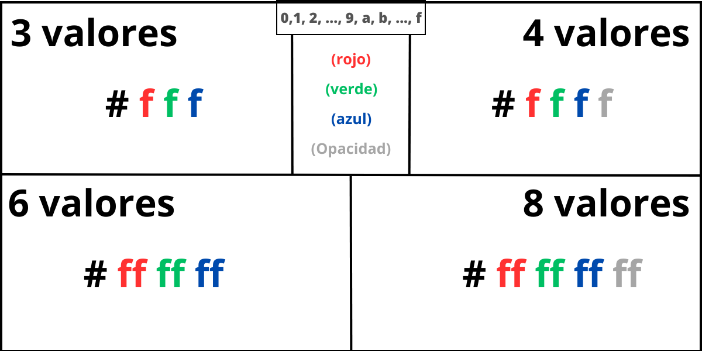

## Iconos y imagenes pequeñas

[**{Web para usar iconos chuletas}**](https://fontawesome.com/)

```
Cuando crees la cuenta, copias pegas en el <head> la etiqueta que saldrá y los podrás coger (<script ...> algo asi)
    > Hay premium y no premium
Cuando queramos usar una imagen, ponemos el elemento con una class que tenga el nombre del id de la foto
    > (P.e: fas fa-home, fas -> icono solid, fa-home -> icono de una casa raro)
```

## Responsive Design

```
Adaptar el diseño de la web a distintas resoluciones
Ordenar a medida que varia la resolución para que se pueda visualizar bien
    > Poner barras desplegables cuando no quepa el contenido (menu responsive)
    > Poner el contenido lateral a contenido horizontal y debajo del main
    > etc.

Desktop first -> Adaptar de web de escritorio a mobile (De grande a pequeño)
Mobile first -> Adaptar de mobile a resoluciones web (De pequeño a grande)
    > Es el que mejor posiciona Google por SEO
Content first -> Dependiendo del contenido que tenemos, seguir una forma o otra

Media Queries "@media (...) {Selectores{...}...}"
    > Consulta el ancho y alto de la pantalla, orientación o resolución (@media...)

Limites del tamaño:
min-width: ...px -> resolución minima
max-width: ...px -> resolución maxima

Tipos:
all -> Apto para todos los dispositivos
print -> Destinado a material impreso y visualización de documentos
screen -> Destinado principalmente para las pantallas
speech -> Destinado a sintetizadores de voz

Operadores:
    > Primero de programación bro
and -> Si cumple ambos lo ejecuta
or -> Si cumple uno lo ejecuta

Orientación:
landscape -> Mas ancho que largo (horizontal)
potrait -> Mas largo que ancho (vertical)

> Poner "<meta name="viewport" content="width=device-width, initial-scale=1" />"
para que funcione en moviles
```

```
Ejemplos:
@media (min-width: 1200px) {...}
    > Rango mayor de 1200 harás estas instrucciones ({...})
@media (min-width: 800px) and (max-width: 1199px) {...}
    > Entre 800 y 1199 harás estas otras
@media (max-width: 799px) {...}
    > Menos de 800 harás estas otras cosas
@media screen and (max-width: 400px) {...}
    > Si es una pantalla, y tiene menos de 400px de width, harás esto
```

## Maquetar la web I (Flexbox)

```
Para que funcione, necesitamos un flex container y los elementps que van dentro
    > Si ponemos flex a cualquier cosa sola, se comportará como bloque y ya
Tenemos 2 ejes, eje x (main axis), eje y (cross axis)
    > Son como 2 vectores perpendiculares, con inicio y final
    > En default es main axis (horizontal)

> Los elementos para ser mostrados necesitan un height y un width (si estan vacios)
```

### Propiedades de container

```
display: flex; -> Obligado, para que actue como flex

flex-direction:
    row (Por defecto) -> Muestra los elementos en fila (1ero -> ultimo)
    row-reverse -> Muestra los elementos en fila al revés (ultimo -> 1ero)
    column -> Muestra los elementos en columna (1ero -> ultimo)
    column-reverse -> Muestra los elementos en columna al revés (ultimo -> 1ero)
flex-wrap:
    no-wap (Por defecto) -> Se adapta la caja a la pantalla, haciendola mas pequeña si no cabe
    wrap -> Respeta el ancho especifico, y si no cabe en la pantalla lo pone en una nueva fila abajo
    wrap-reverse -> Lo mismo que el wrap, pero en vez de poner la fila abajo la pone arriba
flex-flow: flex-direction flex-wrap; (shorthand)

justify-content -> Alinear los elementos del contenedor desde el content
    center -> Contenido se pone en el centro
    space-around -> Es como hacer el "margin: auto;" en el elemento
        > Es decir, se acomoda a la pantalla dejando espacio como lo hace el margin
    space-between -> Como el anterior, pero pone todo el espacio entre cajas
        > Los extremos los pega a la pared
    space-evenly -> Como el around, pero todos tienen el mismo espacio entre 'paredes'
```

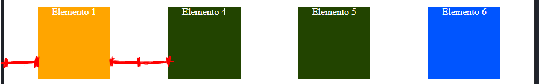
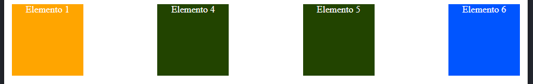
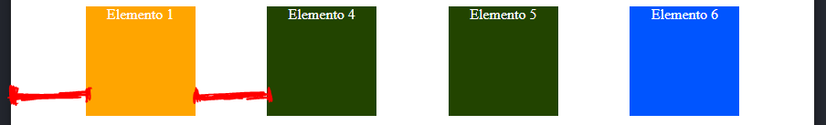

```
align-items -> Para colocar el contenedor en la pantalla
    stretch -> Lo pone arriba del todo (y se estira a lo largo del contenedor)
    flex-start -> Lo pone arriba del todo
    center -> Lo centra verticalmente
    flex-end -> Lo pone abajo del todo
    baseline -> Caso especifico para que quede abajo
        > (P.e: Cuando tenemos un wrap-reverse, no sirve el flex-end, usar este)

align-content -> Lo mismo que en items, pero para varias líneas
    stretch...
    ...

- La diferencia entre los 2 align, es que el primero se ve mal para varias lineas, y el segundo funciona para los 2
    > Solo cuando tienen un espacio mas grande que el que tienen automaticamente
        > Si está en items se adapta al contenedor, si es en content se pone todo junto
```

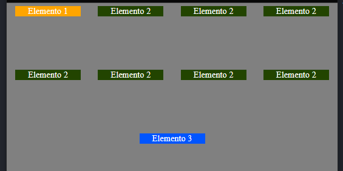
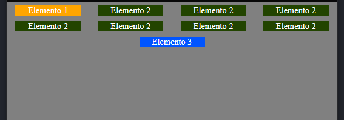

### Propiedades de item

```
align-self -> Lo mismo que el align-items, pero para los elementos
    > Para darle diferentes posiciones a los elementos individualmente
    > stretch, flex-start... y eso

min-width / min-height: poner un minimo de tamaño, para que no se haga mas pequeño, pero si mas grande
max-width / max-height: Al revés del anterior

[CAMBIO IMPORTANTE CON MARGIN EN FLEX]:
Al hacer margin-(direccion):auto, ocupará todo lo posible y se pondrá al final
    > (P.e: margin-left:auto; se irá a la derecha del todo)
Cuando haces auto en 2 direcciones contrarias, se pone en el centro
  > Por eso, al hacer margin: auto; se pone en el centro de la pantalla
    > top, botton, left y right son auto, entonces se contrarestan todos

flex-grow -> Agarra el espacio sobrante, y lo añade
    > Si hay varios, todos augmentan hasta ocupar el contenedor
        > Esto pasa siempre, adaptandose al tamaño de la pantalla
    > Si todos tienen el mismo numero, se adaptan lo mismo
        > 1/n cada uno, suponiendo n elementos, si son 3 -> 1/3
    > (P.e: Si uno tiene '1', y otro tiene '2', si sobran 300px, 200 van al 2 y 100 al 1)
        > Equitativo vaya
```

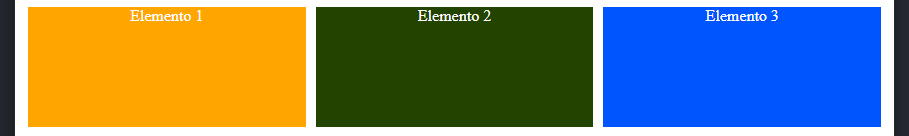

```

flex-basis -> Basicamente el width, para los items de flex
    > Usar esto en vez de lo otro y ya
flex-shrink -> Cuando se deforman las cajas, el espacio que va a ceder comparado con las otras
    > (P.e: Si pones a un elemento un flex-shrink de 2, será la mitad de grande que las otras, y si es 3 -> 1/3...)
        > También puedes hacerlo con 0.5 para que ocupe el doble, y los demás cedan la mitad
    > Si pones "0", nunca va a ceder espacio, cuando se hace mas pequeño se queda igual y los demás se adaptan
    > Cuando miden lo que tienen que medir (width:...), van a ser iguales, solo cuando las haces mas pequeñas ocurre esto
    > Lo hacen progresivo, van a llegar al width a la vez todos (solo que augmentan con "velocidad" diferente)
flex: flex-grow flex-shrink flex-basis (shorthand)
```

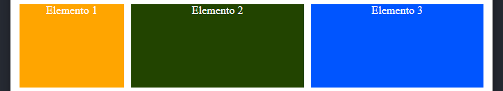

```
order -> Es como la posición que tendrá el elemento en el conteo
    > (P.e: Si pones order:4, aunque lo hayas puesto el primero en el html, lo pondrá en el 4o elemento de la lista y lo imprime en esa posición)
    > (P.e2: Si al ultimo le pones order:1 lo pondrá el primer elemento)
    > Y puedes mover el orden de las cajas como te cundax

> Lo mismo que el z-index, mejor poner numeros grandes entre cajas, para no cambiar una a una
```

## Maquetar la web II (Grid)

```
Estilo de layout, a traves de una "parrilla", como una tabla (pero sin ser una tabla)
Es como el flex, con un contenedor con items dentro, pero con display: grid

Conceptos:
Grid container -> contenedor de tipo grid
    > Lo mismo que el flex, si solo ponemos 1, se comporta como bloque y ya
Grid item -> elemento que metamos al contenedor
Grid cell -> celdas del grid
    > Podemos definir las celdas, pero no tenemos por que poner un item en cada celda, ya estarán definidas
Grid traks -> Column y Row (numero de traks = columnas + filas)
Grid area -> Podemos juntar celdas para hacer "areas" (tenemos que definirlo nosotros)
    > Obviamente tenemos que formar cuadrados o rectangulos, no podemos juntar 2 celdas diagonales, ni otras formas
Grid line -> Líneas divisoras de la tabla
    > Empezamos a contar desde la primera (la pegada a la pared digamos), no solo las que separan celdas
    > (Mirar foto)
```

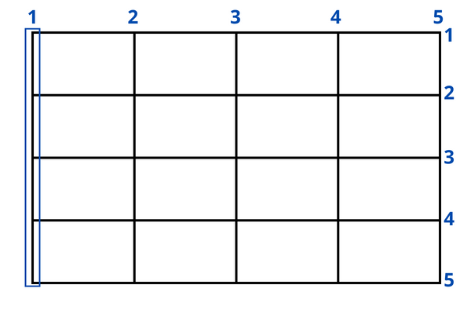

### Propiedades container

```
display: grid -> Obligado, para que actue como grid

grid-template-rows -> Numero de filas del grid
    > Ponemos el tamaño, el numero de veces que filas queramos poner
    > (P.e: Quieres poner 3 filas de 150 px cada una -> grid-template-rows: 150px 150px 150px)
grid-template-columns -> Numero de columnas del grid
    > Lo mismo que el rows pero en columns

repeat(numero_celdas, tamaño) -> Función para no tener que repetir el tamaño por cada fila/columna que queramos poner
    > Si ponemos 2 cosas en el "tamaño", las repite n veces, es como un repetidor de lo que hay en el segundo parametro n veces
        > Es decir: repeat(3, 100px 120px) -> 100px 120px 100px 120px 100px 120px)
        > (Que no es unicamente para el grid vaya, es una función)

Unidad "1fr"
    > Se adapta a la pantalla, y se estira si lo varias
    > Muy parecido al flex-grow

grid-row-gap -> Especie de margin ENTRE CELDAS, separando las filas
    > A los bordes estarán pegados, pero entre celdas no
grid-column-gap -> Lo mismo pero en columnas
grid-gap: grid-row-gap grid-column-gap (shorthand)
```

### Propiedades item

```
Crear areas (juntar celdas):

grid-row-start -> Desde que LINEA (start) empiezas a contar hasta la otra que quieres juntar
grid-row-end -> Desde ese "start", hasta que LINEA quieres juntar (end)
grid-row: grid-row-start / grid-row-end (shorthand)
    > 1 "/" 3, 2 "/" 4, etc. poner la barra

Ejemplo: quieres juntar el primer cuadrado
1 / 3 == pilla desde la línea 1 (la pared del contenedor), hasta la 3 (osea 2 cuadrados)
1 / 2 == no haces nada, pilla desde la línea 1 hasta la 2, pero eso ya es el primer cuadrado

grid-column-start -> Lo mismo pero en columna
grid-column-end -> Lo mismo pero en columna
grid-column: grid-column-start / grid-column-end (shorthand)

> Desplaza los demás items de sitio
    > P.e. 1,2,3, hago el 1 mas grande, seguiran mostrando 1,2,3 (no desaparece el 2)
> Si no quieres hacerlo con líneas contandolas
    > Poner 1 / span n (n numero de cuadrados que quieres agrupar) y listo
    > (P.e: 1 / span 2 == 1 / 3 (es lo mismo)
            1 / span 3 == 1 / 4)
- Lo bueno es para hacer grupos invertidos, es mucho mas comodo poner un inicio, y la cantidad de celdas que agrupas que el shorthand
    > (Es un datón, lo se, pero por si te interesa)
```

### Grid implicito / explicito

```
Grid implicito: Cuando no cabe en la tabla (porque unimos varias celdas o lo que sea), crea una nueva fila (por defecto)

grid-auto-rows -> Podremos definir las nuevas filas que cree automaticamente que tamaño debe tener
    > Con solo poner 1 tamaño ya vale para todas
grid-auto-columns -> Lo mismo que row pero en column
    > Se puede definir si quieres que crezca en filas, o en columnas, por eso esto
grid-auto-flow -> Definir como quieres que crezca
    row (Por defecto)-> Cuando no cabe un elemento crea filas y lo pone
    column -> Cuando no cabe un elemento crea columnas y lo pone
    dense -> Los espacios que esten vacios entre elementos los rellena con el siguiente elemento
        > (P.e. has hecho un area, y lo has movido de sitio al de al lado (con un start mas grande que el de la celda))

Grid explicito: Para controlar mejor, mas dinamico

ESTO IRÁ DENTRO DEL REPEAT (repeat(cantidad, tamaños))

Tamaños:
    > De base, cuando pones "fr", se puede variar el tamaño hasta la palabra mas grande del elemento
Puedes cambiar el fr por esto:
min-content -> Pone el tamaño minimo (palabra mas larga) constante
max-content -> Pone el tamaño de todo el texto del elemento constante
minmax(minimo, maximo) -> Poner el rango que va a medir la celda, cuando llega a los extremos se queda constante
    > (P.e: grid-template-columns: repeat(3, minmax(100px, 300px)))
        > También se puede poner min-content dentro de minmax, en alguno de los 2 rangos

Cantidad:
auto-fill -> Generarme todas las columnas que puedas, si la pantalla te lo permite
    > Si es muy chico, muchas filas, si es muy grande, pocas filas
    > Muy usado galerias de fotos
auto-fit -> Lo mueve, y además lo reescala a la fila
    > El otro no lo hace, va generando columnas y si ha llegado a un tope con los elementos lo sigue haciendo con elementos vacios
```

### Alineación y control de flujo

```
justify-items -> Contenido se ajusta y coloca "horizontalmente" (respecto izquierda y derecha)
    stretch -> Ya lo vimos en flex en general
    center -> Pone en el centro de la COLUMNA
        > Si hay 3 columnas, cada uno se pone en su centro
    start -> Lo pone al inicio de la columna
    flex-start -> Lo mismo que el start
    end -> Lo pone al final de la columna
    flex-end -> Lo mismo que el end
align-items -> Lo mismo que el justify-items, pero "verticalmente" (respecto arriba y abajo)
    center: Pone en el centro de la FILA
    ...
justify-content / align-content -> Es lo mismo que antes, pero con la diferencia que el anterior alineaba los items, y ahora alineamos las columnas y las filas
    > Osea si hay un espacio, puedes mover las columnas a la derecha, o al centro, etc.
    > Si los elementos ocupan todo el grid, no habrá un cambio obviamente

> Se puede usar el space-around, space-between, y space-evenly del flex aquí (pero no en el de los items, solo el del content)
> Aqui no funcionan las transiciones, si lo quieres mover de un lado a otro si pasas el ratón por encima se hará instantaniamente
    > Usar otras herramientas

justify-self / align-self -> Para colocar un item de forma individual, lo ponemos en el selector del elemento
    > start, end, center y to eso
place-self: justify-self align-self (shorthand)

order -> Funciona igual que el flex
    > Muy parecido al z-index, pero todos los elementos pesan igual
    > (P.e: Si pones order:2, se pondrá al final de todo (porque todas por defecto son 0))
        > Final del todo es derecha abajo, y principio es izquierda arriba
```

### Posicionamiento areas Grid con secciones

```
Cuando creemos la web, podemos posicionar la web con grid de esta forma:

grid-template-areas -> Patrón que seguirá la web, donde colocará cada cosa
    > (P.e:
    "header header header"
    "aside main main"
    "aside main main"
    "footer footer footer"
    Y la web se colocará con:
        > Una línea por encima de la web header
        > Una parte aside debajo del header, con una parte main
        > Un footer al fondo)
Y para poder colocar el elemento habrá que ir al div (o lo que sea, nav, etc.) de cada sección y poner
grid-area: nombre_area (header, aside, o el nombre que hayas puesto arriba)
```

### Nombrar lineas

```
Cuando creamos un grid podemos ponerle nombres a las lineas, y cuando vayamos a juntar celdas podemos llamar al nombre de la línea en vez de al numero
Para hacerlo, se pone en el grid-template-rows / grid-template-columns, y antes de poner el tamaño de la columna, poner [nombre_linea] (entre corchetes)
    > (P.e: grid-template-rows: [first-l] 150px [second-l] 200px [third-l]; (el third line es la ultima linea))
        > Y luego haces: grid-row: first-l / third-l == grid-row: 1 / 3 (es lo mismo)
```

## Transition

```
Para que no cambie de forma instantanea, y haga una transición de cambio

transition-property -> Poner que es lo que quieres que cambie
    propiedades -> Lo que quieres que cambie (background, font-size...)
    all -> No recomendable, puede que consuma recursos inecesarios y que la web cargue lento
    none -> Ninguna
transition-duration -> Tiempo que tarda en hacer la transición
    > Si hay varias transition-property, podemos poner diferentes tiempos también, separando cada tiempo de cada property con una coma
        > El primer tiempo irá con la primera property, el segundo con el segundo, etc.
transition-delay -> Delay que se le añade sin hacer nada, cuando pase el tiempo hará la transición
transition-timing-function -> Curba del tiempo que va a tardar en realizar la animación (transición en funcion del tiempo)
    linear -> Linear, siempre constante
    ease -> Empieza rapido termina lento
    ease-in -> Empieza lento termina rapido
    ease-out -> Como el ease, pero menos brusco
    ease-in-out -> Nomenterao, pero otra forma de que se mueva vaya
transition: transition-property transition-duration etc. (shorthand)
```

[**{Diferencia entre las funciones del transition-timing-function}**](https://youtu.be/OWKXEJN67FE?t=30002)

## Animaciones

```
Parecido a las transiciones, pero con una regla "@keyFrames", que es con lo que definiremos las animaciones

Crear animación:
[@KeyFrames nombre_animacion {Comportamiento}]

Tenemos 2 formas de definir como se va a comportar:
1. from {propiedades iniciales} to {propiedades finales}
2. 0% {propiedades iniciales} 100% {propiedades finales}
   > Lo bueno de porcentajes es que podemos poner diferentes "%" entre medias (50% {propiedades intermedias})

Llamar a la animación con el elemento:
    > Es importante posicionar el elemento para que funcione bien la animación
animation-name: nombre_animacion; (obligao)
animation-duration: segundos; (obligao)
animation-timing-function -> lo mismo que el transition (linear, ease, etc.)
animation-iteration-count -> Numero de repeticiones de la animación (0,1... infinite)
animation-direction -> Cambia el orden de la animación
    normal -> El por defecto (0% -> 100%)
    reverse -> Al contrario (100% -> 0%)
    alternate -> normal, y luego reverse (0% -> 100% -> 0%)
        > Solo funciona con count > 2
    alternate-reverse -> igual que el alternate pero al revés (100% -> 0% -> 100%)
animation-fill-mode -> Como se quedará al final
    none (Por defecto) -> Vuelve al principio
    forwards -> Se queda donde acaba a la animación
        > (P.e: Si pones un alternate, y va de principio a fin y luego al principio, se quedará al principio)
    both -> Arranca con la posición de la animación, y al final actua como un forwards
        > (P.e: Si el elemento base es rojo, en la animación al principio es verde, si tiene un delay con both será verde, si tiene delay con forwards será en rojo)
    backwards -> Arranca con la posición de la animación, y cuando acaba vuelve al principio
        > Parecido al both, pero sin acabar donde acabe la animación
animation-delay -> Segundos de delay de la animación
```

## Cubic Bezier

```
Modificar la curba de la aceleración
Valor del animation-timing-function / transition-timing-function (entre otros)
Tenemos 4 parametros, 2 para el primer punto y otros 2 para el segundo (imagen)

animation-timing-function: cubic-bezier(x1, y1, x2, y2)
```

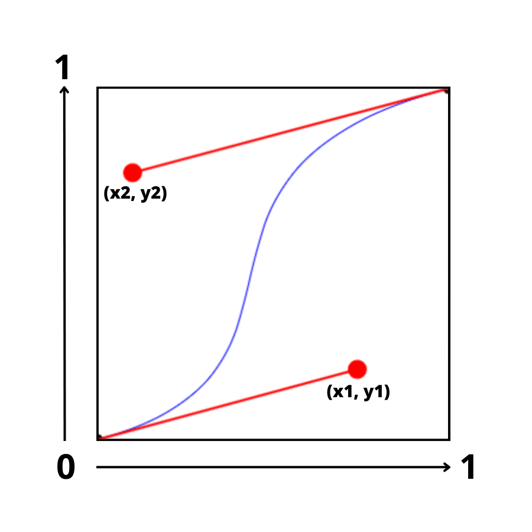
[**{Link para generar el cubic-bezier}**](https://cubic-bezier.com)

## Transform

```
transform -> Transformar el objeto con funciones
    translateX(px, etc.) -> Desplaza el objeto en el eje x
        > (+) -> derecha, (-) -> izquierda
    translateY(px, etc.) -> Lo mismo
        > (+) -> abajo, (-) -> arriba
    translate: translateX translateY (shorthand)

    scale(n) -> Reescala el elemento n veces
        > n == 1, es el elemento, n==2 es el doble de grande, 0.5== la mitad, etc.
    scaleX(n) -> Escalar elemento en la dirección horizontal
    scaleY(n) -> Escalar elemento en la dirección vertical
    scale3d (n n n) -> Escalar elemento en las 3 direcciones (x, y, z)

    rotate(deg, rad) -> Rotar el elemento(deg == grados, rad == radianes)
    rotateX -> Aplicar rotación alrededor del eje X
    rotateY -> Aplicar rotación alrededor del eje Y
    rotateZ -> Aplicar rotación alrededor del eje Z
    skew(deg, rad) -> Lo deformamos como un paralelogramo
    ...

> Podemos dar varias transformaciones separandolas por espacio en el transform
> Si definimos varios transform, nos borra el transform anterior y lo sobreescribe con el nuevo
    > Por si estas haciendo un hover, pon lo que tenias en el tranform anterior en vez de poner solo el nuevo efecto

- Para las animaciones usar el translate, consume menos recursos
- También se usa para cuando se usa el @media, para recolocar la web
```

[**{Todos las transformaciones de transform}**](https://www.w3schools.com/cssref/css3_pr_transform.php)

## Clip-path

```
Para poder hacer formas a los elementos
clip-path: polygon(...)
```

[**{Link a una web para poder poner una forma a un elemento}**](https://bennettfeely.com/clippy/)

## Variables en CSS

```
Crear variable:
[--nombre_variable: variable]
Usar variable:
[mi_propiedad: var(nombre_variable)]

Variable global -> [:root {variables}]
    > Raiz del html, seleccionas todos los elementos

> Dependiendo de donde esté colocado, lo podrán usar unos o otros (local)
    > Solo se podrá usar si es descendiente del tipo donde se lo pones
        > (P.e: si lo defines en un <p>, no la puedes usar en el <a>
        Pero si la defines en un <div> y el <a> está dentro si que podrás)

> Si volvemos a definir la variable dentro de un selector, cambia para ESE selector (y sus descendientes)

> La funcion var() acepta 2 argumentos, siendo el 2o un fallback por si el primero falla (opcional)
```

## Funciones en CSS

```
calc() -> Mezclar diferentes unidades, y lo bueno es que se puede anidar (calc(calc(...)))
    > (P.e:{calc(100vh - calc(3rem + 40px))} )
min() -> Utilizará el que sea el minimo de todos los argumentos que le des
    > (P.e: min(150px, 100%), si el mas pequeño es 150 usará ese, si el mas pequeño es 100% usará ese)
max() -> Igual que min(), pero a la inversa (Puedes pensarlo como el valor minimo permitido que queremos)
clamp() -> Para hacer los elementos responsive. Toma 3 valores: el minimo, el ideal, el maximo
```

## Filtros

```
Es como el transform (mismas mecanicas) pero para ponerle filtros a cosas (blanco y negro, etc.)

filter:
    blur(px, etc.) -> blurrear la imagen (desenfoque)
        > Aqui no funcionan los "%"
    brightness(n) -> Ponerle brillo
        > En n==1 es la imagen, en n==2 es el doble...
        > 1.3 == 130%
    contrast(n) -> Poner contraste
    drop-shadow(mirar abajo) -> Parecido al box-shadow, pero con la imagen transparente se adapta al png la sombra
        > eje x, eje y, cantidad de desenfoque, borde (0 normalmente), color
    grey-scale(n) -> 0 no hay cambio 1 blanco y negro (0-100%)
    hue-rotate(deg) -> rotar la gama de colores
    invert(n) -> Invierte colores
        > 0 no hay cambio, 1 colores invertidos
        > 50% se pone en gris toda la imagen
    opacity(n) -> 1 completamente opaco 0 completamente transparente
    saturate(n) -> satura los colores al color mas fuerte
    sepia(n) -> Lo pone en color sepia (1, y el 0 es la foto normal)
    url("filter_id") -> Poner un filtro usando un archivo SVG o codigo escrito en el HTML
```

[**{Ejemplo de efecto copado}**](https://youtu.be/OWKXEJN67FE?t=33777)

## Direction

```
Cambiar la direccion de como se escriben los textos:

direction:
    ltr -> left to right, como casi todos los textos
    rtl -> right to left, como los textos arabes

> No hay mucha diferencia, se lee igual, solo lo escribe a la derecha
```

## Otros

```
textarea
resize: none; -> Ahora no permitirá hacer resize cuando clickas la esquina

scroll-behavior -> Cuando quieras poner un link a una parte de la web para que no baje instantaniamente y baje con una transicion lenta
    smooth -> Baja o sube hacia la parte de la pagina de forma fluida
    > Se le da a todos los elementos (en el html{...})

user-select: none -> de esta forma no permitimos al usuario no poder seleccionar nada del texto
```
